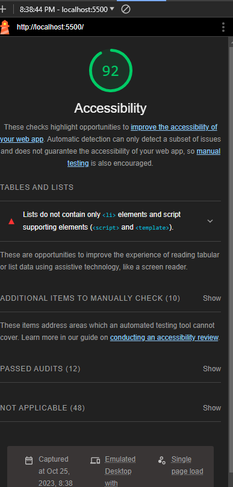

# LAB - 02

## About Me Project

I build a super sick website about a topic I am a Subject Matter Expert in: ME! This is my about me project, still a work in progress.

### Author: Brendan Huddleston

### Links and Resources

- [submission PR](http://xyz.com)
- Any Links you used as reference

### Lighthouse Accessibility Report Score

- 

- 

### Reflections and Comments

- Today's learning was very simple in lecture and I assumed that the lab was going to be a piece of cake since it was very similar to stuff we had done in Code-102 and things I have learned on my own before this course.  I still feel like I did fine on the lab and understand the topics we discussed, but it was definitely more of a challenge implimenting the switches and getting everything to communicate effectively to accomplish the 'user stories'.  I also felt like I could've written a lot of code better and 'cleaner' but think I would've spent all night doing that(hate being a perfectionist).  Also was super stumped on why my lighthouse wasn't generating a score and found out that it has a hard time completing it's task if you have a `while` loop that doesn't go away unless the user inputs the correct answer.  I am still a little fuzzy on what exactly a function is and how many types there are so eager to go into more detail about them in class.

- testing renaming repo
